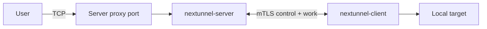

<div align="center">

<h1 style="border-bottom: none"><b>nextunnel-client</b></h1>

[](https://go.dev/)
[](./LICENSE)

<a href="./README.md"></a>
<a href="./README_zh.md"></a>

</div>

## Overview

`nextunnel-client` is the **client** component of the [nextunnel](https://github.com/xiaotiancaipro/nextunnel)
reverse-tunnel system. It connects to [nextunnel-server](https://github.com/xiaotiancaipro/nextunnel-server) over
mutual TLS, registers local proxy definitions, and bridges inbound traffic from the server to services on the client
host.

Capabilities:

- Connect to the server via mutual TLS (mTLS)
- Register TCP proxies and request remote listen ports on the server
- Bridge each inbound user connection to a local `local_ip:local_port` target
- Auto-reconnect with exponential backoff (2 s → 30 s) after disconnect
- Send periodic heartbeats to keep the control channel alive



## Requirements

| Dependency | Notes                                                                                                                                          |
|------------|------------------------------------------------------------------------------------------------------------------------------------------------|
| Go 1.26+   | Required for local builds only                                                                                                                 |
| mTLS certs | Generate with `nextunnel-server client generate-certs` on the server (see [server README](https://github.com/xiaotiancaipro/nextunnel-server)) |

## Quick Start

```bash
# 1. Generate client certificates on the server host
# nextunnel-server client generate-certs ./client-certs

# 2. Copy certs and configuration
mkdir -p certs
cp /path/to/client-certs/{ca.crt,client.crt,client.key} certs/
cp nextunnel-client.example.toml nextunnel-client.toml
# Edit nextunnel-client.toml: server address, client id, proxies, cert paths, timezone

# 3. Build and run (reads nextunnel-client.toml by default)
go build -o nextunnel-client .
./nextunnel-client
```

On startup the client: loads config → initializes mTLS → dials the server → logs in with `[client].id` → applies
`[[proxies]]` to the server → enters the control loop (heartbeat + work connections).

> `[client].id` is **required**; the server rejects an empty client ID.

### Cross-Platform Builds

```bash
./script/build.sh
```

Binaries are written to `dist/` as `nextunnel-client-<version>-<os>-<arch>[.exe]`.

## Docker

The `docker/` directory provides a Compose stack that runs the client with **host networking** (so `local_ip` can reach
services on the host).

```bash
cd docker

# Place certs under volumes/certs/ (ca.crt, client.crt, client.key)
# Edit volumes/config/nextunnel-client.toml (server addr, client id, proxies, timezone)

docker compose up -d
```

Mounted paths inside the container:

| Host path         | Container path                 |
|-------------------|--------------------------------|
| `volumes/config/` | `/usr/local/nextunnel/config/` |
| `volumes/certs/`  | `/usr/local/nextunnel/certs/`  |
| `volumes/logs/`   | `/usr/local/nextunnel/logs/`   |

Default command: `nextunnel-client --config config/nextunnel-client.toml`.

## CLI Reference

```bash
nextunnel-client [--config <path>]    # Start client (foreground)
```

| Flag              | Default                 | Description             |
|-------------------|-------------------------|-------------------------|
| `--config`, `-c`  | `nextunnel-client.toml` | Configuration file path |
| `-h`, `--help`    | —                       | Show help               |
| `-v`, `--version` | —                       | Show version            |

Runs in the foreground with no subcommands. Press `Ctrl+C` or send `SIGTERM` for graceful shutdown.

## Configuration

See [`nextunnel-client.example.toml`](nextunnel-client.example.toml) for a full example.

| Section       | Field                                | Description                                                                       |
|---------------|--------------------------------------|-----------------------------------------------------------------------------------|
| `[server]`    | `addr` / `port`                      | nextunnel-server control endpoint                                                 |
| `[client]`    | `id`                                 | Client identifier (required; must be unique per connected client)                 |
| `[logs]`      | `file`                               | Log path (daily rotation with size-based segments)                                |
|               | `level`                              | `debug`, `info`, `warn`, or `error`                                               |
|               | `maxSize`                            | Max segment size, e.g. `100MB`, `1GB`; bare number = MB                           |
|               | `maxBackups`                         | Max number of daily log files to retain                                           |
|               | `maxAge`                             | Max log retention in days                                                         |
| `[tls]`       | `ca_file` / `cert_file` / `key_file` | CA and client certificate paths for mTLS                                          |
| `[timezone]`  | `location`                           | IANA timezone for log display and daily log rotation; defaults to `Asia/Shanghai` |
| `[[proxies]]` | `name`                               | Proxy name (referenced by the server when opening work connections)               |
|               | `type`                               | Proxy type; currently `tcp`                                                       |
|               | `local_ip` / `local_port`            | Local service to forward traffic to                                               |
|               | `remote_port`                        | Port the server listens on for this proxy                                         |

### Example: SSH via remote port

```toml
[[proxies]]
name = "ssh"
type = "tcp"
local_ip = "127.0.0.1"
local_port = 22
remote_port = 8022
```

After the client connects, users reach the local SSH service via `<server-host>:8022`.

## License

This project is licensed under the [Apache License 2.0](./LICENSE).
